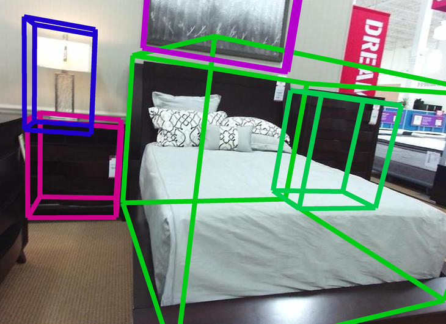
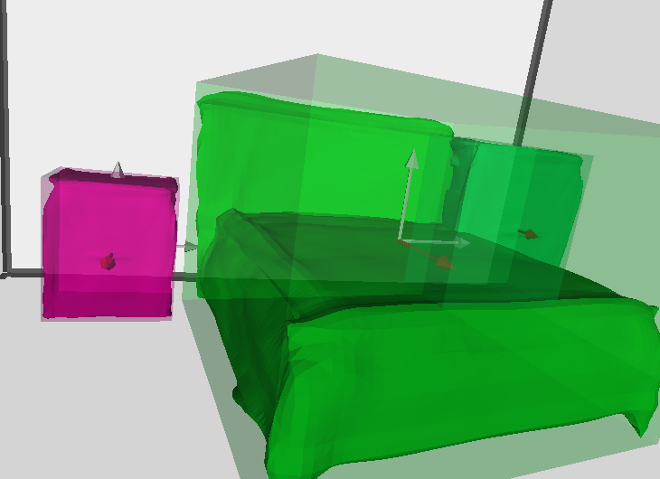
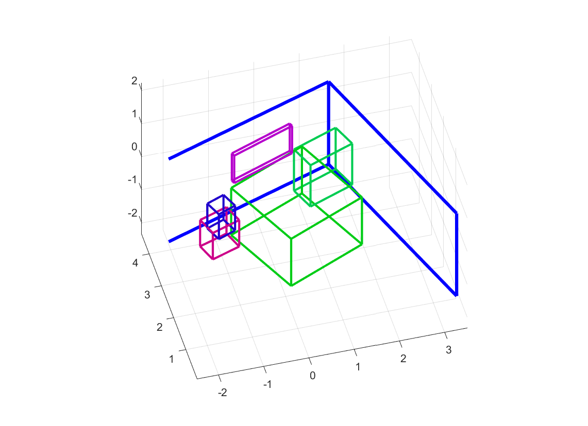

# Implicit 3D Understanding (Im3D)

## Source

```bash
https://github.com/chengzhag/Implicit3DUnderstanding
```

## Download

```bash
https://stduestceducn-my.sharepoint.com/:u:/g/personal/2015010912010_std_uestc_edu_cn/Efs2Tqlkk_pIhy16ud20m5sBMkbkWJEuspiLjdF4G2jOzA?e=sxnswk
```

unzip it into

```bash
implicit-3d-understanding/out/total3d/20110611514267/
```

## Install

```bash
./setup.sh

conda create -n im3d python=3.7
conda activate im3d
pip install torch torchvision torchaudio \
      --extra-index-url https://download.pytorch.org/whl/cu113
pip install wandb tqdm cython pytz python-dateutil \
      trimesh scipy scikit-image shapely jellyfish \
      vtk seaborn h5py opencv-python

HOROVOD_GPU_OPERATIONS=NCCL pip install --no-cache-dir horovod

./build.sh
```

## Run

### Demo

```bash
./run_demo.sh
```

## Train

### Dataset

#### Pix3D

used to train LIEN + LDIF decoder

```bash
http://pix3d.csail.mit.edu/
```

and save it to

```bash
data/pix3d/metadata
```

then, run

```bash
python preprocess.py
```

#### SUN RGB-D

used to train SGCN

```bash
https://rgbd.cs.princeton.edu/
```

Follow [Total3DUnderstanding](https://github.com/yinyunie/Total3DUnderstanding) to download the raw data.

and edit

```bash
data/sunrgbd/Dataset/SUNRGBD/kv2/kinect2data/002922_2014-06-26_15-43-16_094959634447_rgbf000089-resize/annotation2Dfinal/index.json
```

```bash
{"name":""propulsion"tool"}
->
{"name":"tool"}
```

```bash
python -m utils.generate_data
```

## Training and Testing
We use [wandb](https://www.wandb.com/) for logging and visualization.
You can register a wandb account and login before training by ```wandb login```.
In case you don't need to visualize the training process, you can put ```WANDB_MODE=dryrun``` before the commands bellow.

Thanks to the well-structured code of [Total3DUnderstanding](https://github.com/yinyunie/Total3DUnderstanding), we use the same method to manage parameters of each experiment with configuration files (```configs/****.yaml```).
We first follow [Total3DUnderstanding](https://github.com/yinyunie/Total3DUnderstanding) to pretrain each individual module, then jointly finetune the full model with additional physical violation loss.

#### Pretraining
We use the [pretrained checkpoint](https://livebournemouthac-my.sharepoint.com/:u:/g/personal/ynie_bournemouth_ac_uk/EWuyQXemB25Gq5ssOZfFKyQBA7w2URXR3HLvjJiKkChaiA?e=0Zk9n0) of [Total3DUnderstanding](https://github.com/yinyunie/Total3DUnderstanding) to load weights for ODN.
Please download and rename the checkpoint to ```out/pretrained_models/total3d/model_best.pth```.
Other modules can be trained then tested with the following steps:

1. Train LEN by:
    ```
    python main.py configs/layout_estimation.yaml
    ```
    The pretrained checkpoint can be found at ```out/layout_estimation/[start_time]/model_best.pth```
    
2. Train LIEN + LDIF by:
    ```
    python main.py configs/ldif.yaml
    ```
    The pretrained checkpoint can be found at ```out/ldif/[start_time]/model_best.pth```
    (alternatively, you can download the pretrained model [here](https://stduestceducn-my.sharepoint.com/:u:/g/personal/2015010912010_std_uestc_edu_cn/EQj2e3Utbg1HnkNh1e6YslABTml0R8Eng5-X3ic5jD2LFA?e=2vreNA), and unzip it into out/ldif/20101613380518/)
    
    The training process is followed with a quick test without ICP and Chamfer distance evaluated. In case you want to align mesh and evaluate the Chamfer distance during testing:
    ```
    python main.py configs/ldif.yaml --mode train
    ```
    The generated object meshes can be found at ```out/ldif/[start_time]/visualization```
    
3. Replace the checkpoint directories of LEN and LIEN in ```configs/total3d_ldif_gcnn.yaml``` with the checkpoints trained above, then train SGCN by:
    ```
    python main.py configs/total3d_ldif_gcnn.yaml
    ```
    The pretrained checkpoint can be found at ```out/total3d/[start_time]/model_best.pth```

#### Joint finetune

1. Replace the checkpoint directory in ```configs/total3d_ldif_gcnn_joint.yaml``` with the one trained in the last step above, then train the full model by:
    ```
    python main.py configs/total3d_ldif_gcnn_joint.yaml
    ```
    The trained model can be found at ```out/total3d/[start_time]/model_best.pth```
    
2. The training process is followed with a quick test without scene mesh generated. In case you want to generate the scene mesh during testing (which will cost a day on 1080ti due to the unoptimized interface of LDIF CUDA kernel):
    ```
    python main.py configs/total3d_ldif_gcnn_joint.yaml --mode train
    ```
    The testing resaults can be found at ```out/total3d/[start_time]/visualization```

#### Testing

1. The training process above already include a testing process. In case you want to test LIEN+LDIF or full model by yourself:
    ```
    python main.py out/[ldif/total3d]/[start_time]/out_config.yaml --mode test
    ```
    The results will be saved to ```out/total3d/[start_time]/visualization``` and the evaluation metrics will be logged to wandb as run summary.

2. Evaluate 3D object detection with our modified matlab script from [Coop](https://github.com/thusiyuan/cooperative_scene_parsing):
    ```
    external/cooperative_scene_parsing/evaluation/detections/script_eval_detection.m
    ```
    Before running the script, please specify the following parameters:
    ```
    SUNRGBD_path = 'path/to/SUNRGBD';
    result_path = 'path/to/experiment/results/visualization';
    ```

3. Visualize the i-th 3D scene interacively by
    ```
    python utils/visualize.py --result_path out/total3d/[start_time]/visualization --sequence_id [i]
    ```
    or save the 3D detection result and rendered scene mesh by
    ```
    python utils/visualize.py --result_path out/total3d/[start_time]/visualization --sequence_id [i] --save_path []
    ```
    In case you do not have a screen:
    ```
    python utils/visualize.py --result_path out/total3d/[start_time]/visualization --sequence_id [i] --save_path [] --offscreen
    ```
    If nothing goes wrong, you should get results like:
    
     

4. Visualize the detection results from a third person view with our modified matlab script from [Coop](https://github.com/thusiyuan/cooperative_scene_parsing):
    ```
    external/cooperative_scene_parsing/evaluation/vis/show_result.m
    ``` 
    Before running the script, please specify the following parameters:
    ```
    SUNRGBD_path = 'path/to/SUNRGBD';
    save_root = 'path/to/save/the/detection/results';
    paths = {
        {'path/to/save/detection/results', 'path/to/experiment/results/visualization'}, ...
        {'path/to/save/gt/boundingbox/results'}
    };
    vis_pc = false; % or true, if you want to show cloud point ground truth
    views3d = {'oblique', 'top'}; % choose prefered view
    dosave = true; % or false, please place breakpoints to interactively view the results.
    ```
    If nothing goes wrong, you should get results like:
    
    

## Enjoy it~

